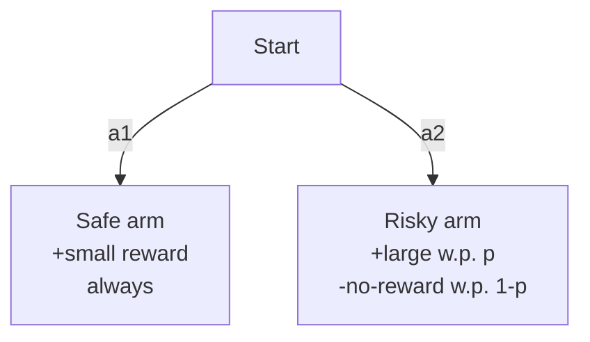

# Computational mechanisms of curiosity and goal-directed exploration

Schwartenbeck, Passecker, Hauser, FitzGerald, Kronbichler, Friston · *eLife* 2019

Jake Watson · Stanhope AI · April 2026

<!--
Plan for the next ~25 min:
- Setup the task and the generative model (Figure 2)
- Derive the variational inference updates
- Derive expected free energy and its three exploratory components
- Parameter learning via Dirichlet conjugacy
- Live reproduction in the browser
- One honest criticism
- Brief extensions + drone work
-->

---

# Roadmap

**Part 1 · The model**
- T-maze task and generative model *(Fig 2)*
- State inference: variational free energy
- Parameter learning: Dirichlet updates

**Part 2 · Planning**
- Expected free energy decomposition
- Extrinsic · salience · novelty
- Policy posterior with precision $\gamma$

**Part 3 · Evidence**
- Live reproduction of Fig 3 and Fig 6
- Where I think it breaks

**Part 4 · Bridging to Stanhope**
- Grid-maze + drone search extensions
- Micro-MANPAD perception work

---
layout: two-cols
---

# The T-maze task

<v-clicks>

- Agent starts at centre
- Left arm: **safe** — small reward, deterministic
- Right arm: **risky** — large reward with unknown probability $p$
- One trial = one arm choice
- $N$ trials to maximise total reward

</v-clicks>

The agent does not know $p$. It must choose between exploiting what it knows (safe) and learning what it doesn't (risky) — without an explicit exploration bonus.

::right::

**Why this task?** It isolates the learning problem. No hidden context, no partial observability — the only uncertainty is about $p$, a parameter of the observation model.

---

# The generative model

A **generative** model is a joint distribution that says *how the world produces observations*:

$$
p(o, s, \theta) \;=\; \underbrace{p(o \mid s, \theta)}_{\text{likelihood}}\;\underbrace{p(s)}_{\text{state prior}}\;\underbrace{p(\theta)}_{\text{parameter prior}}
$$

Read it as: *"if the world were in state $s$ with sensor parameters $\theta$, this is the distribution over observations I'd expect to see."* It is generative because you can **sample from it** — pick an $s$ and $\theta$, the model tells you what $o$ would result.

Contrast with a **discriminative** model like Q-learning or a classifier, which maps observation → decision without representing how data came to be.

**Why it matters: one model, three jobs.**

1. Inference. Invert the joint: $p(s \mid o) \propto p(o \mid s)\,p(s)$. Salience needs this.

2. Simulation. Roll forward under a policy to get $q(o \mid \pi)$. Extrinsic scores it against preferences.

3. Meta-inference. Reason about $\theta$ itself — *how much would observing here sharpen my belief about the sensor?* Novelty is a KL on $q(\theta)$.

Model-free RL has none of these — there is no $p(o \mid s, \theta)$ to invert or roll forward, so *there is nowhere for curiosity to live*. This is the asymmetry that defines active inference.

<!--
The prose bridge between the T-maze setup and the tensor slide. Key line to drop if asked: "same generative model is used three times — to predict what will be observed, to score information gain, and to evaluate preferred outcomes." One model, three jobs.
-->

---

# Figure 2 · four pieces of the model

A discrete POMDP with four pieces: $\{A, B, \mathbf{c}, \mathbf{d}\}$

**States** $s \in \{\text{start, safe, risky}\}$  (3)

**Observations** $o \in \{\text{centre, small, large, none}\}$  (4)

**Actions** $a \in \{\text{go-safe, go-risky}\}$  (2)

$$
A_{o,s} = P(o \mid s)
\quad\text{(4×3, observation model)}
$$

$$
B^{(a)}_{s',s} = P(s' \mid s, a)
\quad\text{(3×3×2, transitions)}
$$

**Preferences** $\mathbf{c} \in \mathbb{R}^{|O|}$ *(log-space)*
$$
\mathbf{c} = [\,0,\ 2,\ 4,\ -2\,]^\top
$$
so $P(o \mid C) \propto \exp(\mathbf{c})$.

**Initial state prior**
$$
\mathbf{d} = [\,1,\ 0,\ 0\,]^\top
$$

The risky column of $A$ is the only uncertain object in the model. Everything else is deterministic and known.

---

# The A-matrix · where uncertainty lives

$$
A \;=\;
\begin{array}{c|ccc}
 & s{=}\text{start} & s{=}\text{safe} & s{=}\text{risky} \\ \hline
o{=}\text{centre} & 1 & 0 & 0 \\
o{=}\text{small}  & 0 & 1 & 0 \\
o{=}\text{large}  & 0 & 0 & p \\
o{=}\text{none}   & 0 & 0 & 1-p
\end{array}
$$

Two deterministic columns (start, safe). One **unknown** column (risky), parametrised by a single scalar $p$.

Belief over the risky column is a **Dirichlet** with concentrations $\boldsymbol{\alpha} \in \mathbb{R}^{2}_+$:

$$
q(A_{\cdot,\text{risky}}) = \text{Dir}(\boldsymbol{\alpha}), \quad
\mathbb{E}[A_{o,\text{risky}}] = \frac{\alpha_o}{\alpha_0}
$$

Paper starts at $\boldsymbol{\alpha}{=}[1,1]$ — maximum a priori uncertainty.

---

# Inference · variational free energy

Exact Bayesian inference $q(s \mid o)$ is intractable in POMDPs. Variational substitute:

$$
\mathcal{F}(\pi) \;=\; \mathbb{E}_{q(s\mid\pi)}\!\left[\ln q(s\mid\pi) - \ln p(\tilde o, s \mid \pi)\right]
$$

Minimising $\mathcal{F}$ yields the **message-passing update** — for each time-step $\tau$:

$$
\boxed{\ q^*(s_\tau \mid \pi)
= \sigma\!\Big(
\underbrace{\ln A^{\!\top}\tilde o_\tau}_{\text{likelihood}}
\;+\; \underbrace{\ln B_{\tau-1}(\pi)\, q^*(s_{\tau-1} \mid \pi)}_{\text{forward}}
\;+\; \underbrace{\ln B_\tau(\pi)^{\!\top}\, q^*(s_{\tau+1} \mid \pi)}_{\text{backward}}
\Big)
\ }
$$

- $\sigma(\cdot)$ = softmax — falls out of constrained minimisation over the simplex (Lagrange + $\sum q = 1$)
- $\ln A^{\!\top} \tilde o$ is **log-evidence** arriving at state $s$
- This is forward-backward in active-inference clothing — a single observation multiplies the prior pointwise and renormalises, exactly like the Kalman update in discrete form

<!--
If asked: where does softmax come from? Answer: minimise F subject to Σq = 1 (simplex). Lagrangian → exponential form → normalisation → softmax. Not an arbitrary choice.
-->

---

# Planning · expected free energy

For actions we can't just minimise $\mathcal{F}$ — future observations aren't observed yet. We take an expectation:

$$
G(\pi, \tau) \;=\; \mathbb{E}_{q(o_\tau,\, s_\tau,\, \theta \mid \pi)}\!\left[
\ln q(s_\tau, \theta \mid \pi) \;-\; \ln p(o_\tau, s_\tau, \theta \mid \pi, C)
\right]
$$

where $\theta = A$ (the unknown parameters) and $C$ encodes preferences via $\mathbf{c}$.

Under a mean-field factorisation $q(s,\theta \mid \pi) = q(s \mid \pi)\, q(\theta)$ and expanding the joint,
we can decompose this into **three interpretable terms**:

$$
G(\pi, \tau) \;=\;
\underbrace{-\,\mathbb{E}_{q(o_\tau\mid\pi)}\!\left[\ln p(o_\tau \mid C)\right]}_{\text{extrinsic / pragmatic cost}}
\;-\; \underbrace{\mathbb{E}_{q}\!\left[D_{\text{KL}}\!\big[q(s_\tau\mid o_\tau,\pi)\,\|\,q(s_\tau\mid\pi)\big]\right]}_{\text{salience (state info gain)}}
\;-\; \underbrace{\mathbb{E}_{q}\!\left[D_{\text{KL}}\!\big[q(\theta\mid s_\tau, o_\tau)\,\|\,q(\theta)\big]\right]}_{\text{novelty (parameter info gain)}}
$$

The minus signs matter: minimising $G$ means **low expected cost** *and* **high expected information gain**. Exploration is not a bonus grafted on — it drops out of the same objective as reward-seeking.

---

# The three terms · what each one <em>buys</em> you

**1 · Extrinsic** — exploitation. Scores expected outcomes against preferences $\mathbf{c}$. The only term a greedy RL agent optimises.

**2 · Salience** — state-info gain. KL between belief *after* seeing $o$ and *before*. Vanishes in the bare T-maze (no cue).

**3 · Novelty** — parameter-info gain. KL on $q(\theta)$. Drives sampling where the sensor is uncertain. **Self-terminating** as $\boldsymbol{\alpha}$ concentrates.

---

# Parameter learning · why Dirichlet

Posterior over the risky column is categorical-likelihood × Dirichlet-prior:

$$
p(\boldsymbol\theta \mid \mathcal{D}) \;\propto\; \text{Cat}(\mathcal{D}\mid\boldsymbol\theta)\,\text{Dir}(\boldsymbol\theta \mid \boldsymbol\alpha)
\;=\; \text{Dir}\!\left(\boldsymbol\alpha + \mathbf{n}\right)
$$

— **conjugate**. Update rule: observe $o$ in state $s$, then $\alpha_{o,s} \mathrel{+}= 1$.

Two moments we need:

$$
\mathbb{E}[\theta_i] = \frac{\alpha_i}{\alpha_0}, \qquad
\mathbb{E}[\ln \theta_i] = \psi(\alpha_i) - \psi(\alpha_0)
$$

$\psi$ = digamma, $\alpha_0 = \sum_i \alpha_i$.

The second identity is what makes **novelty** computable in closed form — no sampling, no amortiser. You evaluate digammas at integer counts.

<!--
This is the bit most ML people fudge. Novelty reduces to a closed-form digamma expression because of conjugacy. Conjugacy is not a convenience, it's what makes the whole EFE calculation tractable in this setting.
-->

---

# Policy selection · precision

Policies are scored by $-G(\pi)$; the policy posterior is itself a softmax:

$$
q(\pi) \;=\; \sigma\!\left(-\gamma \cdot G(\pi)\right), \qquad \gamma \sim \Gamma(1, \beta)
$$

$\gamma$ is **precision** over policies — expected under a Gamma prior with rate $\beta$. $\beta$ is the lever that separates the paper's four experimental regimes:

**Why a prior on $\gamma$ at all?** It lets the agent *modulate its own confidence*. When $G(\pi)$ values are close, $\gamma$ naturally shrinks — *"I genuinely don't know which is better, so don't commit."* The Gamma–Dirichlet pairing is what lets the whole update stay closed-form.

---

# Four things the paper doesn't tell you

A few places you can't read off the paper:

<v-clicks>

- **Policy horizon.** The paper uses $\tau = 2$ (one step). I implemented full $\tau$-lookahead as a sum $\sum_\tau G(\pi, \tau)$ but kept $\tau = 2$ for replication.
- **Expected posterior $q(o \mid \pi)$.** Analytic marginalisation: $q(o \mid \pi) = \sum_s A \cdot q(s \mid \pi)$. Avoids sampling noise at the cost of assuming $A \approx \bar A$ (the plug-in mean).
- **Numerical safety.** $\ln 0$ is a real risk with sparse $A$. I clamp to a small $\varepsilon$, same as the reference `spm_MDP_VB` code.
- **Novelty with $A$-mean vs $A$-sampled.** The analytic form uses $\bar A$; a more honest version takes an expectation over $q(A)$. Difference is small for the paper's configs but noticeable when $\alpha_0$ is small.

</v-clicks>

<!--
These four choices signal you engaged with the paper as an implementer, not a reader. Surface 1-2 of these unprompted; expect them to ask about the others.
-->

---

# Sim · T-maze end-to-end

Python (NumPy) model running in the browser via **Pyodide**. Same `.py` files run locally for validation.

**What maps to what on screen**

- **β (precision)** → policy softmax temperature
- **Extrinsic · Salience · Novelty** → the three EFE weights $w_{\text{ext}}, w_{\text{sal}}, w_{\text{nov}}$
- **Sensor model** panel → the Dirichlet concentrations $\boldsymbol{\alpha}$, updating live
- Agent dropdown toggles the four regimes from the paper

<a href="https://jakeywatson.github.io/stanhope/sim/" target="_blank" class="inline-block px-5 py-2.5 rounded-lg bg-sky-600 hover:bg-sky-500 text-white font-semibold text-base no-underline shadow-lg">
Open the sim →
</a>

jakeywatson.github.io/stanhope/sim

<!--
Demo points to hit live:
1. Active-learning agent: show early risky-arm sampling, novelty term high
2. Watch concentration parameters grow, novelty decay
3. Switch to random (β=2³): exploration never decays
4. Switch to greedy: never discovers risky arm even when it's good
5. Resist live-tweaking — stick to the script
-->

<!--
Demo points to hit live:
1. Active-learning agent: show early risky-arm sampling, novelty term high
2. Watch concentration parameters grow, novelty decay
3. Switch to random (β=2³): exploration never decays
4. Switch to greedy: never discovers risky arm even when it's good
5. Resist live-tweaking — stick to the script
-->

---

# The key result · Figure 6

**What we should see**

<v-clicks>

- Active-learning agent: probability of risky choice **decays** over trials as uncertainty resolves
- Random-exploration agent: probability of risky choice is **flat** — no self-termination
- Greedy agent: if initial estimate $\mathbb{E}[p]$ is low, never recovers — risky column is never revisited

</v-clicks>

**What this tells us**

<v-clicks>

- Exploration collapses *from within the same objective* that drives exploitation
- No separate exploration schedule (ε-greedy, entropy bonus) needed
- The decay rate is a closed-form function of $\psi(\alpha_0)$ — you can compute when curiosity will "turn off"

</v-clicks>

This is the paper's strongest claim — and it replicates.

---

# What I'd push back on

<v-clicks>

- **The A-matrix parameterisation assumes known structure.** The agent only learns the *distribution* over outcomes in the risky column — it already knows the column *exists*. Real-world perception (e.g. a drone) has to learn the structure too.

- **Novelty is count-based, not estimate-based.** After visiting a state twice, $D_\text{KL}[\,q(\theta \mid \text{new}) \,\|\, q(\theta)\,]$ has dropped by a large amount, regardless of whether $\mathbb{E}[\theta]$ is close to the truth. Curiosity turns off before you've *actually* learned.

- **Policy space scales combinatorially.** $\tau = 2$ with 2 actions is fine. $\tau = 5$ in a grid world is $25^5$ policies — you evaluate $G(\pi)$ for every one. Amortisation via neural policies is the obvious next move.

</v-clicks>

None of these are fatal — they're the hinges for where the field has gone since 2019 (active inference with neural amortisers, hierarchical generative models, learned structure).

---

# Extension 1 · grid-maze

- 10×10 grid, fog-of-war observation model
- Goal hidden at unknown cell
- Agent's $A$ is a learned map: $P(\text{wall}, \text{open}, \text{goal} \mid s)$
- Salience now *matters* — visiting a cell reduces state-entropy about its contents
- Novelty still fires for uncertain cells

Shows the same mechanism extends to **real spatial POMDPs**, not just the 3-state toy.

**Why this matters for Stanhope**

Spatial navigation under partial observability is the default, not the exception. The T-maze version of the paper is didactic — the production question is: does the decomposition still give you exploration-that-terminates when the state space is non-trivial?

In the sim: yes, qualitatively. The novelty term decays, coverage increases, path cost is bounded. But — see prior slide — the combinatorics start biting at $\tau > 2$.

---

# Extension 2 · drone search

- 3D grid world with obstacles
- Drone has a camera frustum — partial FoV
- Targets hidden in occluded cells
- Belief over (target-present, target-absent) per cell

**Policy**: where to fly *and* where to look

Salience term chooses viewpoints that *maximally reduce uncertainty* over target locations. This is essentially **next-best-view planning** with a free-energy objective.

**Why this matters**

This is closer to what a perception-led autonomy system actually does. It reframes exploration as *information gathering under embodiment constraints* rather than as a schedule.

The caveat is honest: I built this as a didactic extension in a discrete world. The combinatorial blow-up from the prior slide is real — continuous motion + high-dim observations need amortised policy posteriors, not exhaustive EFE sums.

---

# Ablation · isolating the curiosity contribution

Toggle strips curiosity: $w_{\text{sal}} = w_{\text{nov}} = 0$ and collapses $\beta \to 0.125$ (greedy-precise). "If you only chased the extrinsic signal, how well would you do?"

  
combined

  

    

    
88%

  

  
→

  

    

    
68%

  

  
−20pp

  
active_inference

  

    

    
92%

  

  
→

  

    

    
66%

  

  
−26pp

  
active_learning

  

    

    
89%

  

  
→

  

    

    
57%

  

  
−32pp

  
greedy (control)

  

    

    
62%

  

  
≈

  

    

    
67%

  

  
≈ 0

  
random (control)

  

    

    
80%

  

  
≈

  

    

    
85%

  

  
≈ 0

<b>Full EFE</b> · paper-matched weights

<b>Ablated</b> · extrinsic only, greedy β

target = confirm correct object (6 distractors)

Greedy / random are unchanged by the toggle — <b>control</b>: the switch isolates curiosity rather than just degrading policy. That random still scores 80% reveals the waypoint dispatcher itself encodes active-inference structure (Scan→z=2, Confirm→z=1, Explore→frontier). <b>Curiosity earns the last 10–30pp.</b>

<!--
Key number to anchor: 20–32pp drop for the three curiosity agents, flat for the two controls.
If asked "why is AL's gap biggest?" — AL is novelty-only. Novelty calibrates the sensor model (disc_conc[z]); without it, the agent never validates that z=2 is the discriminating altitude. With small episode counts the variance is high — AL depends on iteratively-built sensor knowledge that never materialises under ablation.
-->

---

# What each gap tells us

### combined · −20pp
**Full EFE:** surveys, Scans top candidates twice at z=2, Confirms at z=1.

**Ablated:** only signal is Confirm extrinsic ($-10$ until $p > 0.55$). Agent wanders until accidental sightings push a belief past threshold — sometimes commits to a distractor.

Cost of giving up deliberate information-gathering.

### active_inference · −26pp
AI is **salience-only** — no novelty.

Salience drives the Scan→Confirm two-step tailor-made for discrimination. Remove it → no mechanism that says *"go look closer at object X"*.

Single-component design brittles under ablation — combined's β-shaping gives it more to fall back on.

### active_learning · −32pp
AL is **novelty-only** — no salience.

Novelty pushes altitude variation to sharpen `disc_conc[z]`. Without it the agent never validates which altitude discriminates.

Depends on iteratively-built sensor knowledge that never materialises. Biggest loser in small-batch runs.

**One-liner.** A drone *with* curiosity surveys, inspects at the discriminating altitude, then commits. Strip curiosity and — even with greedy-precise exploitation — performance drops 20–32pp, because the agent has no mechanism to *seek* information, only to exploit what passive observation hands it.

<!--
Ordering of agents here is intentional: combined → AI → AL, left-to-right, matches the bar chart on the prior slide and also the magnitude of the loss (20 → 26 → 32pp).
If asked about the greedy/random controls: greedy already had w_sal=w_nov=0 and β=0.125, so the toggle is a no-op for it. Random uses β=8 and the toggle skips it. The ~5pp drift in each is RNG.
-->

---
layout: center
class: text-center
---

# Drone work at Munin Dynamics

Feb — Aug 2025 · camera-guided interceptor (Micro-MANPAD)

Munin's bet: the cheapest, smallest missile system that can take out an FPV drone — pocket-sized, scalable to Ukraine-sized threat volumes. My remit was the perception stack on the interceptor itself.

**Problem**
- Detect 7″ quadcopter at 30–350 m
- 150 m/s closing velocity
- SWaP: <30 mm diameter processing board
- $250 production BoM

**What I built**
- Camera / SBC selection against DRI/Johnson criteria
- FOMO detector, trained on-platform, int8-quantised
- Capture → detect → track pipeline on a Digi ConnectCore 93
- Field-test support

**Numbers that mattered**
- FOMO vs YOLOv11n: **90% recall vs mAP50 0.27**
- Model size: **~200 KB** (vs ~5 MB)
- Inference: **<1 ms** at 128×128
- BoM well inside $250

Earlier · <b>Frazer-Nash</b> (autonomous-vehicle vision, Dstl-adjacent): rebuilt the perception pipeline 20 → 70+ fps on Jetson and scoped ML safety cases for UGV perception.

---

# Where this work meets Stanhope

The perception I built is the **discriminative layer**. Everything interesting Stanhope (and this paper) does sits *above* it.

**What my pipeline *does***

- Pixels → $\{\text{drone},\ \varnothing\}$ in <1 ms on a $10 SBC
- No posterior — no notion of *"I don't know"*
- Retrain per domain: clutter, lighting, target drift
- Greedy tracker: chase the highest-confidence box

**What active inference *adds***

- Explicit $q(\theta)$ — a budget for what's unknown
- Salience + novelty planned *ahead* → **where should the sensor look next?**
- One objective drives pursuit *and* exploration — no $\varepsilon$-greedy
- Self-terminating curiosity (digamma, closed form)

Stanhope's Real World Model is pitched at exactly this layer — adaptive, uncertainty-aware behaviour on small autonomous platforms, trialled in drone & robotics partnerships. Frazer-Nash's SENTINEL (RL for sensor management) is the same problem shape; active inference derives it from one variational objective instead of a hand-engineered reward.

The offering: I've shipped the perception pipeline that sits <em>underneath</em> a Stanhope-style agent on a defence UAS. What I came here for is the agent on top.

<!--
If asked "why did you leave Munin?" — it's an excellent applied problem but the ceiling is a better detector; I want to work on the planner above it. If asked about Frazer-Nash SENTINEL in interview: it's an RL-for-sensor-management system; active inference collapses the same objective to salience + novelty without a separately learned reward model.
-->

---
layout: center
class: text-center
---

# Thanks

Sim · <a href="https://jakeywatson.github.io/stanhope/sim/" target="_blank">jakeywatson.github.io/stanhope/sim</a> 
Source · <a href="https://github.com/jakeywatson/stanhope" target="_blank">github.com/jakeywatson/stanhope</a>

Questions.

